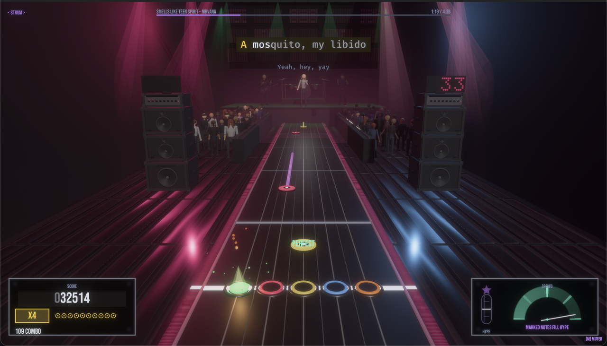
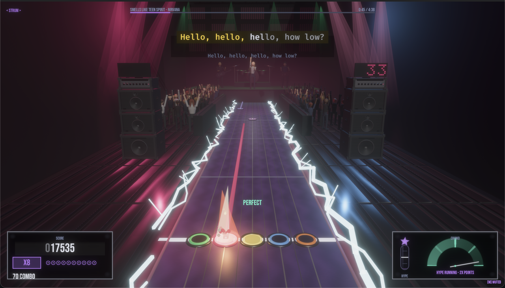
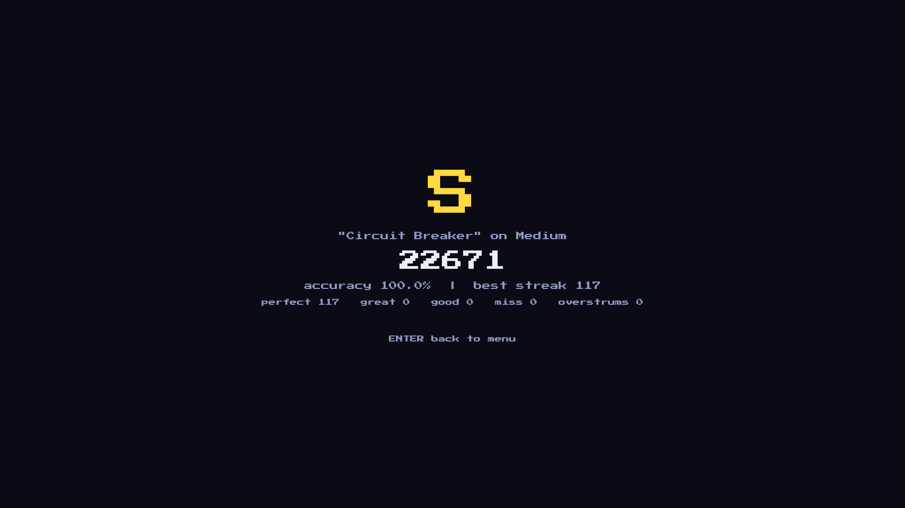

<div align="center">

# 🎸 BeatByte

**An original five-lane rhythm game. Your music. Pixel-art or polished — your call.**

### Status

[](https://github.com/pepperonas/beatbyte/actions/workflows/ci.yml)
[](https://github.com/pepperonas/beatbyte/actions/workflows/release.yml)
[](https://github.com/pepperonas/beatbyte/releases)
[](https://github.com/pepperonas/beatbyte/releases)
[](https://github.com/pepperonas/beatbyte/releases)
[](https://github.com/pepperonas/beatbyte/commits/main)
[](https://github.com/pepperonas/beatbyte/commits/main)
[](https://github.com/pepperonas/beatbyte/issues)
[](https://github.com/pepperonas/beatbyte/issues?q=is%3Aissue+is%3Aclosed)
[](https://github.com/pepperonas/beatbyte/pulls)
[](https://github.com/pepperonas/beatbyte/stargazers)
[](https://github.com/pepperonas/beatbyte/network/members)
[](https://github.com/pepperonas/beatbyte/watchers)
[](https://github.com/pepperonas/beatbyte/graphs/contributors)
[](https://github.com/pepperonas/beatbyte)
[](https://github.com/pepperonas/beatbyte)
[](https://github.com/pepperonas/beatbyte)
[](https://github.com/pepperonas/beatbyte/commits/main)
[](CONTRIBUTING.md)

### Quality

[](LICENSE)
[](CHANGELOG.md)
[](CHANGELOG.md)
[](https://www.conventionalcommits.org/)
[](#testing)
[](Cargo.toml)
[](Cargo.toml)
[](Cargo.toml)
[](crates/beatbyte-game/src/lib.rs)
[](#how-your-music-becomes-a-playable-track)
[](#testing)
[](docs/decisions/README.md)
[](Cargo.toml)
[](docs/development/harness.md)
[](docs/)
[](docs/ui/design-system.md)
[](docs/ui/3d-stage.md)
[](docs/chart-format/chart-format-v1.md)
[](apps/beatbyte/tests/docs_stay_true.rs)
[](crates/beatbyte-chart/src/lib.rs)
[](CHANGELOG.md)
[](docs/audio/analysis.md)
[](Cargo.toml)
[](#legal)
[](#legal)
[](#building-from-source)

### Tech

[](https://www.rust-lang.org/)
[](Cargo.toml)
[](https://bevy.org/)
[](crates/beatbyte-audio)
[-9cf)](crates/beatbyte-game/src/xplorer.rs)
[](#development)
[](#building-from-source)
[](https://www.rust-lang.org/)

### Platforms

[](https://github.com/pepperonas/beatbyte/releases)
[](https://github.com/pepperonas/beatbyte/releases)
[](https://github.com/pepperonas/beatbyte/releases)
[](https://github.com/pepperonas/beatbyte/releases)
[](https://github.com/pepperonas/beatbyte/releases)

### Gameplay

[](#features)
[](#features)
[](#features)
[](#how-your-music-becomes-a-playable-track)
[](#controls)
[](#controls)
[](#supported-guitars--controllers)
[](#supported-guitars--controllers)
[](#controls)
[](#features)
[](#features)
[](#features)
[](#features)
[](docs/decisions/ADR-0006-synthesized-demo-content.md)
[](#how-your-music-becomes-a-playable-track)
[](#controls)
[](#controls)
[](#features)
[](#legal)
[](#legal)
[](#legal)
[](#legal)
[](#legal)

### Support

[](https://www.paypal.com/donate/?business=martin.pfeffer%40celox.io)
[](https://g.page/r/CXgdRV3QysvxEBM/review)

</div>

---

BeatByte is an original, open-source rhythm game in the classic five-lane guitar
tradition — rebuilt from scratch in **Rust** and **Bevy**. It ships two
looks: a crisp 8-bit / pixel-art identity, and a smooth high-res style
with round gems, a depth-view highway and bloom — switchable in-game.
Drop in your own music, let BeatByte analyze it
and generate a playable chart, then shred it solo or with up to four players on
one machine.


> **Status: all thirteen build milestones complete** — playable solo or
> with friends, themed, packaged for all three platforms. 0.x versions
> until the tuning settles; see the [roadmap](#roadmap).

<p align="center">
  
</p>

*A flawless run in progress: x4 multiplier, 75-note combo, PERFECT
popup, hit particles on the triangle receptor — with the Metal theme's
ember backdrop. Every lane has its own shape (square, circle, diamond,
triangle, cross), so color is never the only signal.*

<p align="center">
  
</p>

*The same engine with the 8-bit mode switched off and the depth view
on: a vanishing-point highway, HDR bloom, lit glossy gems growing out
of the distance. Both views and both styles are switchable in the
settings — and the projection is presentation only (identical
autopilot scores prove it).*

<p align="center">
  
</p>

## Features

- 🎸 **Classic five-lane gameplay** — single notes, chords, sustains,
  hammer-ons/pull-offs, combos, multipliers and the Hype meter
- ♿ **Colorblind-safe by default** — every lane has a distinct gem
  shape on notes and receptors; a Stage Motion setting stills the
  backdrop for reduced motion
- 🎵 **Bring your own music** — WAV / OGG / FLAC / MP3 / M4A; drop generated
  charts into `songs/` and they appear in the browser
- 🤖 **Automatic chart generation** — BPM & onset analysis turns any song
  into a playable chart across four difficulties (playable, not perfect —
  the built-in editor is the correction pass)
- ✏️ **Chart editor** — beat grid, note placement, HOPOs, audio preview,
  undo/redo, validated saves
- 👾 **Two looks** — an 8-bit pixel identity (pixel font, six themed
  stages, procedural beat-reactive backdrops) and a smooth high-res
  style (round gems, perspective highway, bloom); every asset
  generated or openly licensed
- 🕹️ **Controllers** — keyboard, gamepads and guitar-style controllers,
  fully remappable in-game
- 👥 **Local multiplayer** — 2–4 players, versus and co-op, split highways
- ⏱️ **Serious timing** — deterministic judgment engine, reconciled song
  clock, configurable hit windows, in-game latency calibration
- 🏆 **High scores**, persistent settings, procedural SFX, two original
  synthesized tracks ("Circuit Breaker" at 128 BPM, "Solder Groove" at
  92) — and an autopilot that must play every build flawlessly before
  release
- 🖥️ **Cross-platform** — macOS (.dmg), Windows (portable), Linux
  (AppImage); WebAssembly on the horizon

## Supported Platforms

| Platform | Status |
|----------|--------|
| macOS (Apple Silicon & Intel) | ✅ primary target |
| Windows | ✅ primary target |
| Linux | ✅ primary target |
| Web (WASM) | 🔮 future |

## Supported Guitars & Controllers

BeatByte plays with a keyboard out of the box — but it is a guitar game
at heart, and it ships its own native guitar driver.

| Controller | Connection | Status |
|------------|------------|--------|
| **Guitar Hero X-plorer** (RedOctane, wired Xbox 360, USB `1430:4748`) | **built-in native driver** (userspace libusb — no kernel driver, no config) | ✅ **verified on real hardware** |
| Any controller your OS shows as a gamepad (Xbox, PlayStation, generic HID pads) | system gamepad support | ✅ works, fully remappable in-game |
| PS3 Guitar Hero / Rock Band guitars (USB dongle) | standard USB HID | 🟡 expected to work through the gamepad path + remapping — unverified |
| Xbox 360 **wireless** guitars | Xbox 360 Wireless Receiver + OS driver | 🟡 Windows/Linux where the OS exposes them; ❌ macOS (no driver exists) |
| Wii, PS4 and Xbox One (GH Live) guitars | Bluetooth / proprietary wireless | ❌ not supported |

**Why the X-plorer needs (and gets) special treatment:** it speaks the
Xbox 360 *vendor* protocol, not standard HID — macOS never shows it as
a game controller, so generic gamepad layers are blind to it. BeatByte
includes a userspace USB reader that claims the device, decodes its
20-byte interrupt reports and feeds them into the engine as a
first-class gamepad: green–orange frets, strum bar (d-pad), Start =
pause, Back = Hype. Tilt and whammy are not game mechanics in BeatByte
(Hype is a button), so nothing is lost. Verify any device on the
**INPUT TEST** screen in the main menu: five fret lamps, strum flash,
Hype lamp, and a would-hit indicator that applies the active mode's
rule.

## Installation

Grab a build from the
[Releases](https://github.com/pepperonas/beatbyte/releases) page:

- **macOS**: `BeatByte-<version>-<arch>.dmg` (or the portable tar.gz).
  The binaries are unsigned — right-click → Open on first launch.
- **Windows**: portable zip — unzip, run `beatbyte.exe`.
- **Linux**: `BeatByte-<version>-x86_64.AppImage` (`chmod +x`, run) or
  the portable tar.gz.

Or build from source (below).

## How Your Music Becomes a Playable Track

Drop audio files onto the window (or use `beatbyte-cli`) and BeatByte
turns them into charts — locally, deterministically, no cloud. The
pipeline, in order:

1. **Import** — dropped files are checked against the supported
   extensions (`.wav .ogg .flac .mp3 .m4a`), queued as a batch (with an
   animated progress panel), de-duplicated, and copied into
   `songs/imported/<sanitized-name>/`. Your files never leave your
   machine and are never committed anywhere.
2. **Decode** — [rodio](https://github.com/RustAudio/rodio) with
   [Symphonia](https://github.com/pdeljanov/Symphonia) decoders opens
   the file (for `.m4a`: the ISO-MP4 demuxer + AAC codec), downmixes to
   mono `f32` at the file's native sample rate. Analysis decodes at most
   20 minutes into memory (a deliberate cap — untrusted input);
   playback later *streams* from disk instead.
3. **Onset detection** — a from-scratch spectral-flux pipeline:
   STFT → log-compressed magnitude spectra → half-wave-rectified flux →
   adaptive median threshold → local-maximum peak picking. Every stage
   is a pure function over sample buffers.
4. **Tempo & beat grid** — BPM from the autocorrelation of the flux
   envelope, weighted by a log-normal prior around 120 BPM (to pick the
   right tempo octave), refined with parabolic interpolation for
   sub-BPM resolution; the beat grid is then phase-fitted so beats land
   on actual onsets.
5. **Melody extraction** — the Guitar-Hero-style layer: harmonic/
   percussive separation (HPSS median filtering) isolates the tonal
   layer, per-frame pitch salience over a semitone grid (register-
   weighted toward the lead) is tracked into a contour by dynamic
   programming, and stable runs become **melody notes with their true
   start, end and pitch**.
6. **Master chart** — one authored truth per song, the official-
   charting workflow: melody notes drive placement (lanes follow the
   riff's pitch contour, green low → orange high; onsets fill the
   percussive rest), and a held tone becomes a **sustain of its real
   held length**, trimmed by the tempo-scaled trailing gap the
   charting community standardized. While a strong melody note is
   held, the lead owns the highway — no drum hits stacked on top.
7. **Difficulty derivation** — Easy/Medium/Hard/Expert are
   *derivations of the same master* (thinning by strength and
   spacing, lane remap onto 3/4/5 lanes, per-difficulty HOPO and
   chord rules) — so a note you learned on Easy sits on the same
   lane on Expert. Same audio in → bit-identical charts out; there
   is no randomness anywhere.
8. **Validation** — charts are treated as untrusted input even though
   we just generated them: BPM clamped to 20–400, size caps, path
   traversal and Windows-drive rejection.
9. **Play (and correct)** — the song appears in the browser with all
   four difficulties. Generated charts are *playable, not perfect* —
   the built-in editor is the correction pass.

Full walkthrough: [docs/importing-songs.md](docs/importing-songs.md) ·
analysis details: [`docs/audio/`](docs/audio/).

## Building from Source

Requirements: [Rust](https://rustup.rs/) 1.95 or newer. That's it — no
Python, no Node.js.

```bash
git clone https://github.com/pepperonas/beatbyte.git
cd beatbyte
cargo run --release -p beatbyte
```

On Linux you additionally need Bevy's system dependencies:

```bash
sudo apt-get install libasound2-dev libudev-dev libwayland-dev libxkbcommon-dev
```

## Running the Game

**The one command**, from the repository root:

```bash
cargo run --release -p beatbyte
```

That builds what has changed and starts the game. Use `--release`: the
debug profile is playable but noticeably less smooth.

### Starting it again without a rebuild

Once built, launch the binary directly and skip Cargo entirely — it
finds its assets by walking up from its own location, so it starts from
anywhere:

```bash
cargo build --release -p beatbyte     # once, after code changes
./target/release/beatbyte             # every time after that
```

**Start it from the repository root** even so. The repository's own
`songs/` folder is read relative to the working directory, so launching
from elsewhere silently drops the charts kept there — measured on this
repository: nine songs from the root, four from `/tmp`. Songs you
imported in-game are unaffected; they live in an absolute path (below).

On macOS, wrap long sessions so the display cannot sleep out from under
the window (a sleeping display closes it and ends the run):

```bash
caffeinate -dis ./target/release/beatbyte
```

### Useful switches for a manual run

| Command | What it does |
|---------|--------------|
| `BEATBYTE_WINDOW=1280x800 ./target/release/beatbyte` | Pin the window size |
| `BEATBYTE_FPS=1 ./target/release/beatbyte` | Print median and 99th-percentile frame time every five seconds |
| `BEATBYTE_SMOKE_TEST=1 ./target/release/beatbyte` | Boot to the menu and exit 0 — a four-second check that the build is sound |

The full list, including the automated harnesses, is in
[the harness reference](docs/development/harness.md).

### Once it is running

Arrow keys and `Enter` move through the menus (the mouse works too);
`A S D F G` are the frets, `Space` strums, `Esc` pauses, `M` mutes.
[Controls in full](#controls).

Your settings and imported songs live outside the repository, so they
survive a `cargo clean` and a fresh clone:

| | macOS | Linux | Windows |
|---|---|---|---|
| Settings | `~/Library/Application Support/beatbyte/settings.json` | `~/.config/beatbyte/settings.json` | `%APPDATA%\beatbyte\settings.json` |
| Imported songs | `~/Library/Application Support/beatbyte/songs/` | `~/.local/share/beatbyte/songs/` | `%APPDATA%\beatbyte\songs\` |

Charts in the repository's own `songs/` folder are picked up too — that
is where `beatbyte-cli generate` writes by default — but only when the
game is started from the repository root, as noted above.

## Development

```bash
cargo run -p beatbyte        # run the game (dev profile)
cargo test --workspace       # run all tests
cargo fmt --all              # format
cargo clippy --workspace --all-targets --all-features -- -D warnings
```

The repository is a Cargo workspace:

| Crate | Purpose |
|-------|---------|
| `beatbyte-core` | Domain model: timing, notes, scoring, rules. Engine-free. |
| `beatbyte-chart` | Versioned chart format, serialization, validation. |
| `beatbyte-audio` | Decoding, playback, song clock, music analysis. |
| `beatbyte-game` | Bevy plugins: gameplay, rendering, UI, effects. |
| `beatbyte-cli` | `beatbyte` command line: analyze, generate, validate. |
| `beatbyte-editor` | Chart editor (architecture prepared, built later). |
| `apps/beatbyte` | The shippable game binary. |

Architecture decisions are documented as ADRs in
[`docs/decisions/`](docs/decisions/). Start with
[ADR-0001](docs/decisions/ADR-0001-rust-and-bevy.md).

## Controls

*Default mapping — everything is remappable (Milestone 8).*

| Action | Keyboard |
|--------|----------|
| Frets 1–5 | `A` `S` `D` `F` `G` |
| Strum | `Space` (or `↑`/`↓`) |
| Hype (special) | `Enter` |
| Pause | `Esc` |
| Mute / unmute all audio | `M` (or click the corner badge) |
| Menus | arrows + `Enter` / `Esc` — or the **mouse** (hover, click, wheel, right-click = back) |
| Song browser | column headers **click to sort** (again = reverse) · `S` cycles sorting · `F` (or a typed `/`) opens the search filter, case- and accent-insensitive |

Verify any device on the **INPUT TEST** screen (main menu): fret
lamps, strum flash, Hype lamp, and a would-hit indicator for the
active mode (tap / strum), toggleable on the spot with `T`.

Settings (volumes, scroll speed, effect toggles, fullscreen) and the
latency calibration live in-game and persist between sessions. Put
charts into `songs/` (e.g. from `beatbyte-cli generate`) and they appear
in the song browser.

## Chart Format & Song Importing

BeatByte uses a versioned JSON chart format documented in
[`docs/chart-format/`](docs/chart-format/). Songs are imported from common
audio formats and analyzed automatically:

```text
song.mp3 → analyze → generate → preview → play
```

Automatic charts are meant to be **playable, not perfect** — the toolchain is
designed for a `generated chart → human correction → final chart` workflow.
**[docs/importing-songs.md](docs/importing-songs.md)** walks through the whole
flow (every command in it verified end-to-end); see
[`docs/audio/`](docs/audio/) for analysis quality notes.

## CLI

The tooling binary is `beatbyte-cli` (the game itself owns the `beatbyte`
name):

```bash
beatbyte-cli analyze song.ogg      # BPM, beats, onsets
beatbyte-cli generate song.ogg     # produce a BeatByte chart
beatbyte-cli validate chart.json   # validate a chart file
beatbyte-cli inspect chart.json    # summarize a chart
beatbyte-cli demo                  # render the built-in songs + charts
```

## Testing

```bash
cargo test --workspace          # 422 tests
```

| Crate | Tests | Covers |
|---|---:|---|
| `beatbyte-core` | 78 | Timing windows to their exact boundaries, judgment, scoring, combos, HOPO and tap rules, the hype meter, the telemetry schema |
| `beatbyte-chart` | 76 | Format validation, untrusted-input limits, chart generation, difficulty derivation, musical quantisation, chart versions, energy-aware escalation |
| `beatbyte-game` | 164 | UI kit contracts, settings persistence, library scanning, import naming, the X-plorer report decoder, texture geometry, the song ribbon, list scrolling |
| `beatbyte-audio` | 60 | Onset detection, tempo estimation, melody contours, the song clock, the error-sound voices, real-file decoding for every advertised format |
| `beatbyte-cli` | 13 | Review analytics and the design dossier: section windowing, evidence thresholds, hash binding, the mastery veto, write instructions |
| `beatbyte-editor` | 19 | Every edit operation round-trips through its own inverse |
| `beatbyte` | 11 | Documentation consistency: these numbers, the version, the badges, the links, the ADR index, the harness switches, and the figures the rules document quotes |

Integration tests decode real fixture files for each supported format,
including `.m4a`, so "we support AAC" is a passing test rather than a
claim. The total is the table's sum plus one documentation example
that is compiled and run.

**These numbers are checked, not maintained.**
`apps/beatbyte/tests/docs_stay_true.rs` counts the test functions in
each crate and fails if this table disagrees, and does the same for
the version, the badges that state a fact, the ADR index, the harness
reference and every repository link in this file. Every one of those
numbers had already drifted at least once — the test count twice in a
single day — because nothing about a wrong number looks wrong.

### Harnesses

On top of the unit tests sit harnesses that run a **real build** —
window, renderer, audio thread and input pipeline included:

```bash
BEATBYTE_SMOKE_TEST=1 cargo run -p beatbyte   # boots to menu, exits 0
BEATBYTE_AUTOPILOT=1  cargo run -p beatbyte   # plays a song — must be flawless
```

The autopilot injects timestamped inputs and **fails on any miss or
overstrum**. Because judgment is input-stamp-driven, that verdict is
frame-rate independent — a hitch cannot cause a miss, so the result does
not depend on the machine. Every release must pass it.

Further modes cover multiplayer, real key presses, tap mode, the editor,
drag-and-drop import, deletion and per-screen screenshots. Full
reference, including the traps that have cost time before:
**[docs/development/harness.md](docs/development/harness.md)**.

### What is deliberately not automated

Chart *quality* is judged by ear, not by the harness. A transcription
rework once measured better on eight synthetic scenes and played
noticeably worse; it was reverted. Any change to charting is A/B'd
against the tag `chart-feel-good-20260826` on real music before it
touches a chart on disk. The harness is a regression guard, not a
verdict on how a song feels to play.

## Release Process

Releases follow [Semantic Versioning](https://semver.org/) and
[Keep a Changelog](https://keepachangelog.com/), with one rule specific
to this project: **the patch number rises with every user-visible
change**, in the same commit, so the version a build reports identifies
that build rather than the last release.

A tag (`v*`) is a separate act — it triggers the release workflow,
which builds and publishes native binaries for every supported
platform — and happens at milestones, covering however many patch
versions accumulated. A test fails if the manifest ever carries a
version the changelog does not describe. See
[`docs/releases/process.md`](docs/releases/process.md).

## Contributing

Contributions are welcome! Please read [CONTRIBUTING.md](CONTRIBUTING.md)
and the [Code of Conduct](CODE_OF_CONDUCT.md) first. Security issues: see
[SECURITY.md](SECURITY.md).

## Support the Project

BeatByte is free, open source and ad-free. If it made you smile:

<a href="https://www.paypal.com/donate/?business=martin.pfeffer%40celox.io"></a>
<a href="https://g.page/r/CXgdRV3QysvxEBM/review"></a>

- 💛 **Donate** via PayPal: [martin.pfeffer@celox.io](https://www.paypal.com/donate/?business=martin.pfeffer%40celox.io)
- ⭐ **Rate my work** on Google Maps: [g.page/r/CXgdRV3QysvxEBM/review](https://g.page/r/CXgdRV3QysvxEBM/review)
- 🌟 Star the repo, file issues, send PRs — all equally appreciated.

## Roadmap

- [x] **M1 — Foundation**: workspace, CI, docs, minimal Bevy app
- [x] **M2 — Core domain**: chart model, timing, scoring, validation
- [x] **M3 — Audio**: decoding, playback, song clock, BPM/onset analysis
- [x] **M4 — Chart generation**: audio → analysis → playable chart
- [x] **M5 — First playable**: five lanes, hits, scoring, combos
- [x] **M6 — Game feel**: particles, shake, lighting, feedback
- [x] **M7 — UI**: menus, song browser, settings, calibration, results
- [x] **M8 — Controllers**: gamepads, guitar controllers, remapping
- [x] **M9 — Local multiplayer**: 2–4 players, versus & co-op
- [x] **M10 — Themes**: Garage, Punk, Metal, Stadium, Psychedelic, Cyber
- [x] **M11 — Chart editor**
- [x] **M12 — Packaging**: .dmg, portable builds, AppImage
- [x] **M13 — Polish pass**

## Legal

BeatByte is an original work inspired by the classic guitar rhythm game
genre. It contains no copyrighted assets, music, artwork or trademarks from
any commercial rhythm game. All bundled assets are original, procedurally
generated, or appropriately licensed (CC0 / public domain / OFL) — see
[`docs/development/asset-licenses.md`](docs/development/asset-licenses.md).

## License

[MIT](LICENSE) © 2026 [Martin Pfeffer](AUTHORS.md)
