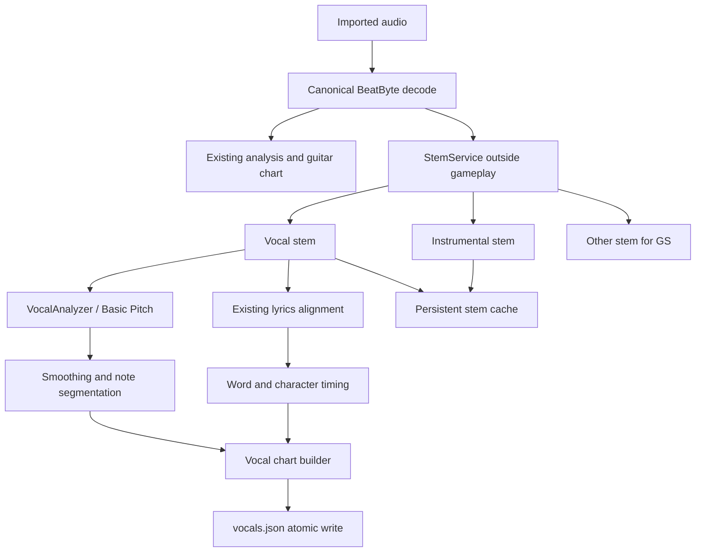
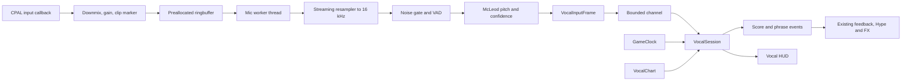

# Vocal/Karaoke Gameplay — architecture and implementation plan

**Status:** Proposed — implementation requires explicit approval  
**Scope:** One singer in V1; data and runtime contracts remain ready for
multiple vocal parts and microphones  
**Last analysed:** 2026-09-19, BeatByte `c626267`

## Goal

BeatByte gains a first-class vocal mode. A player sings into a microphone
while the game compares the captured fundamental frequency and timing with a
persistent vocal chart. The game shows the expected melody, the detected live
pitch, high/low direction, note coverage, phrase feedback, combo, Hype, running
score, and a vocal result at the end of the song.

Offline song analysis and realtime play remain strictly separate:

- **Offline:** decode the song, separate stems, extract and segment the vocal
  melody, align lyrics, build a vocal chart, and store the result.
- **Realtime:** capture a microphone, run lightweight pitch detection, compare
  its timestamped frames with the stored chart, score, and render.

The instrumental game remains playable when no microphone, separator, model,
lyrics, or reliable vocal chart is available. Duets, automatic vocal-range
detection, and transposition are later extensions rather than V1 work.

## Current architecture

### Crate boundaries

| Crate | Current responsibility | Vocal responsibility |
|---|---|---|
| `beatbyte-core` | Deterministic gameplay, score, timing, music-analysis values | Vocal chart values, `VocalSession`, scoring and results |
| `beatbyte-chart` | Chart schema, validation, versions and lyric loading | Vocal-sidecar loading and validation |
| `beatbyte-audio` | Decode, resampling, FFT analysis, playback and audio input | Offline F0, realtime pitch capture and stem playback |
| `beatbyte-game` | Bevy ECS, import, gameplay, rendering, settings and results | Vocal plugin, HUD, device UX and orchestration |
| `beatbyte-lyrics` | Local CTC forced alignment | Reuse alignment against the vocal stem |
| `beatbyte-ml` | Pinned local ONNX models through `rten` | Host an approved Vocal F0/note model |
| `beatbyte-meter` | Local beat and downbeat inference | Existing musical time basis remains authoritative |
| `beatbyte-cli` | Headless analysis and maintenance commands | Vocal analysis, diagnosis and batch migration |

There is no concrete `SongGraph` type in the code. The role is currently split
between `SongAnalysis`, `ChartFile`, the tracked beat grid and per-song
sidecars. A vocal chart should extend this set rather than introduce a second
song timeline.

### Song import

Drag-and-drop import runs away from the frame thread on Bevy's async compute
pool in [`crates/beatbyte-game/src/import.rs`](../../crates/beatbyte-game/src/import.rs).
The current job:

1. copies the source audio and accompanying lyrics;
2. decodes it onto BeatByte's canonical, priming-trimmed timeline;
3. runs `SpectralAnalyzer`;
4. optionally refines beats/downbeats with `beatbyte-meter`;
5. generates, validates and writes a versioned guitar chart;
6. writes the loudness/quality sidecar; and
7. optionally queues a Guitar Study stem job.

This is already the correct execution boundary for vocal analysis. A normal
import remains successful once its audio and guitar chart are durable. Vocal
work can continue as a visible background chore without delaying normal play.

### Existing stem separation

[`crates/beatbyte-game/src/study_twin.rs`](../../crates/beatbyte-game/src/study_twin.rs)
already invokes an external `demucs` installation with model `htdemucs`, tries
Apple MPS before CPU, runs only outside gameplay, and feeds a canonical decoded
WAV into the separator. Its result is currently temporary and specialized for
the `[GS]` chart.

This should become a shared `StemService`. One full four-stem run can provide:

- `vocals` for target extraction and lyric alignment;
- `drums + bass + other` as the instrumental karaoke backing; and
- `other` for the existing Guitar Study chart.

That avoids running the expensive separator twice for the same song.

The accepted
[`ADR-0014`](../decisions/ADR-0014-vocal-stems-as-local-input.md) permits a
local vocal stem as pipeline input but does not permit BeatByte to distribute a
separator model while the model-weight and training-data licensing remains
unclear. V1 therefore builds on the already-supported external local Demucs
tool. Missing Demucs is a persistent, actionable analysis state rather than a
failed song import.

### Existing music analysis

[`beatbyte-audio::Analyzer`](../../crates/beatbyte-audio/src/analysis/mod.rs)
already provides an interchangeable analysis boundary. `SpectralAnalyzer`
produces beats, onsets, energy, repeated sections and a lead melody.

The melody stage in
[`melody.rs`](../../crates/beatbyte-audio/src/analysis/melody.rs) already uses
STFT, harmonic/percussive separation, harmonic salience, dynamic-programming
contour tracking and note segmentation. Its output uses fractional MIDI values,
which is the right musical representation. It is tuned for guitar charting on a
semitone grid, however, and does not provide sufficient cent resolution,
voicing probability, pitch bends or vocal-specific confidence for karaoke
judgment.

### Lyrics

BeatByte already supports standard LRC, enhanced LRC, word spans, character
spans, per-song offsets, word-by-word fill, the next line and an instrumental
countdown. The persistent `<audio>.words.json` schema is owned by
[`beatbyte-lyrics`](../../crates/beatbyte-lyrics/src/words.rs).

The forced-alignment job in
[`beatbyte-lyrics/src/job.rs`](../../crates/beatbyte-lyrics/src/job.rs) already:

- runs outside the frame thread;
- accepts a separated vocal stem;
- records separator and model provenance;
- compares against the original song hash and duration; and
- writes atomically through a `.part` file.

The gameplay lyric renderer in
[`gameplay/lyrics.rs`](../../crates/beatbyte-game/src/gameplay/lyrics.rs) uses
the same `GameClock::visual_time` as note rendering. Vocal gameplay should reuse
this renderer and its cue selection rather than create a separate lyric clock.

The currently registered `wav2vec2-base-960h` acoustic model is English. A
future multilingual aligner must remain behind the existing alignment
interface.

### Microphone input

The workspace already depends on `cpal`. The listener in
[`beatbyte-audio/src/listen.rs`](../../crates/beatbyte-audio/src/listen.rs)
opens the default input on its own thread and calculates room level and tempo.
It already distinguishes opening, listening, unavailable and silent/no-permission
conditions. It currently discards every sample after those aggregate values.

The stage listener and vocal capture must use one shared input stream. Opening
the same microphone independently can fail, choose different configurations,
or produce timestamps that cannot be compared. The listener should evolve into
an `InputEngine` that fans the same captured stream out to the existing stage
meters and to a vocal pitch worker.

### Playback and timing

[`beatbyte-audio/src/playback.rs`](../../crates/beatbyte-audio/src/playback.rs)
owns playback on a dedicated thread. Its handle offers nonblocking play, pause,
seek, rate and position operations. The authoritative gameplay timeline is
`GameClock` in
[`beatbyte-game/src/audio_sys.rs`](../../crates/beatbyte-game/src/audio_sys.rs),
which reconciles monotonic game time against the audio device position.

Judgment reads `song_time`. Visuals read `visual_time`, which adds only the
configured video offset. Vocal frames must be timestamped onto `song_time`; no
independent vocal clock is allowed.

Playback currently owns one music source. Adjustable instrumental and original
vocal levels require one sample-synchronous mixed source in the audio thread.
Starting two independent players is not acceptable because pause, seek,
practice speed and long-song drift would no longer be sample aligned.

### Gameplay, feedback and results

Instrument gameplay consists of deterministic `TrackSession` and
`PlayerPerformance` state in `beatbyte-core`, a Bevy `PlayerSession` component,
and a central `SessionFeedback` message stream in
[`gameplay/mod.rs`](../../crates/beatbyte-game/src/gameplay/mod.rs). HUD, sounds,
particles, stage lighting and Room Stage consume that shared feedback.

Continuous singing cannot honestly be represented as guitar `NoteHit` inputs.
A deterministic `VocalSession` is required, but its phrase outcomes, combo,
Hype and presentation events should feed the same gameplay feedback boundary.
There must not be a second Hype or effects implementation.

`LastResults` currently stores only instrumental `PlayerPerformance`. It should
gain `vocalists: Vec<VocalResult>` so a run can contain instrument players and
vocals and later support more than one singer.

### Calibration, settings and accessibility

The current calibration screen in
[`crates/beatbyte-game/src/calibration.rs`](../../crates/beatbyte-game/src/calibration.rs)
measures player taps against a click and stores an input offset. That value
contains controller latency and human reaction and therefore cannot serve as a
microphone offset.

Persistent settings already migrate leniently with `#[serde(default)]` and
contain music volume, input and video offsets, lyric settings, reduced flashing,
reduced motion controls, effect intensity and high contrast. Vocal settings
should use the same schema and sanitization rules.

### Persistent files

Per-song persistence currently includes:

- `chart.json`, `chart.vN.json` and `chart-active.json`;
- `<audio>.words.json`;
- `<audio>.lyrics-offset.json`;
- `<audio>.loudness.json`; and
- optional `.lrc` files.

There is no general `SongAnalysis` cache. Raw analysis is converted into chart
content and discarded. Demucs outputs are also currently removed after the
Guitar Study job. Vocal gameplay needs durable stem and vocal-chart caches.

## Gap analysis

| Area | Exists | Extend | New work |
|---|---|---|---|
| Import | Background tasks, progress, chart versions | Queue vocal work automatically | Durable vocal job state and resume |
| Stems | Demucs process, MPS/CPU fallback, Chore queue | Shared separator service | Stem manifest and karaoke backing |
| Offline pitch | Melody analysis and fractional MIDI | Reuse DSP and validation | Vocal F0 analyzer and confidence |
| Lyrics | Words, characters and vocal-stem alignment | Link words to vocal phrases/notes | Syllable/note association |
| Microphone | CPAL thread, RMS and failure states | Single shared capture engine | Device choice, pitch frames and ringbuffer |
| Timeline | Reconciled `GameClock` | Map capture times to song time | Separate mic calibration |
| Rules | Deterministic session and feedback bus | Shared combo/Hype core | `VocalSession` and scoring |
| Rendering | HUD, lyrics, plots and accessibility | Add a BeatByte vocal layer | Target bars and live pitch curve |
| Results | Score, timing and streak | Add vocal result sections | Vocal metrics and optional heatmap |
| Debug | Gameplay overlay | Add vocal telemetry | Pitch history and processing latency |
| Old songs | Library scan and Chore queue | Lazy vocal generation | Persistent terminal states |

## Technical choices

### Audio capture — CPAL

Keep `cpal`. It is already integrated and supports input device enumeration,
stable device identifiers, stream configuration, buffer information and device
clocks across CoreAudio, WASAPI and Linux backends. It is Apache-2.0 and fully
local. No second capture library adds value.

Source: [RustAudio CPAL](https://github.com/RustAudio/cpal).

### Realtime pitch — McLeod Pitch Method

Use McLeod Pitch Method through the small MIT-licensed Rust
[`pitch-detection`](https://github.com/alesgenova/pitch-detection) crate behind
a BeatByte-owned `RealtimePitchDetector` trait. McLeod is suitable for
monophonic singing and vibrato and produces a clarity value usable as
confidence.

Initial runtime configuration to validate:

- mono resample to 16 kHz;
- 1024-sample window, about 64 ms;
- 256-sample hop, about 16 ms;
- configured vocal range instead of unrestricted peak search; and
- RMS gate plus clarity threshold before a frame is considered voiced.

The dependency is simple but has a low release cadence. Before adoption it
must pass an allocation audit, synthetic-signal corpus and realtime CPU
benchmark. The trait makes a future FFT-YIN or other detector replaceable.

### Offline vocal F0 — Basic Pitch ONNX

Use Spotify Basic Pitch's ONNX model through `beatbyte-ml`/`rten`, provided a
technical spike confirms all graph operators. Basic Pitch is Apache-2.0,
supports voice, note events and pitch bends, and works best on one isolated
instrument—which is precisely the separated vocal-stem condition.

Sources:

- [Basic Pitch repository](https://github.com/spotify/basic-pitch)
- [Basic Pitch model description](https://basicpitch.spotify.com/about)

The ONNX model and its exact source revision, byte length, SHA-256 and license
must enter `beatbyte-ml`'s registry and asset-license document before use. If
the model cannot run under `rten`, the fallback is a native pYIN implementation
behind the same `VocalAnalyzer` trait rather than a Python runtime in the game.

### Stem separation — existing external Demucs

Use the existing local `htdemucs` integration. It has strong vocal separation,
supports Apple MPS and CPU, and is already proven against BeatByte's decoded
timeline. Separation remains an offline background chore. The upstream code is
MIT, but the existing ADR's model-weight concern still prevents bundling the
separator.

Source: [Demucs](https://github.com/facebookresearch/demucs). The original
repository is no longer actively maintained, which is an additional long-term
maintenance risk.

### Vocal note segmentation

Keep segmentation as deterministic Rust postprocessing over Basic Pitch's
frame and onset outputs:

1. discard low-confidence and out-of-range frames;
2. median-filter short pitch spikes without smoothing away vibrato;
3. bridge short unvoiced gaps;
4. split at reliable onsets, sustained pitch transitions and sufficiently long
   unvoiced spans;
5. preserve pitch bends as a sparse fractional-MIDI contour; and
6. derive note and phrase confidence from voiced coverage and model confidence.

No separate runtime dependency is needed.

### Lyrics alignment

Reuse the current Wav2Vec2 CTC forced aligner on the vocal stem. It already
records provenance and enforces the original song timeline. V1 links vocal
notes to words. Syllable extraction can be added behind a language-aware
interface later; guessed English syllables must not be applied globally.

### Rejected dependency

Aubio supplies YIN/YINFFT and confidence, but it is GPLv3. Pulling it into an
MIT desktop game creates unnecessary distribution constraints. Python librosa
pYIN is a useful reference implementation, not a runtime dependency.

## Persistent vocal model

Store vocal data in `<audio-stem>.vocals.json`. It stays outside `chart.json`
because guitar-chart versions and hashes must remain unchanged, vocal analysis
can be regenerated independently, and old BeatByte versions can safely ignore
the sidecar.

```rust
struct VocalChartFile {
    schema: String,                 // "beatbyte.vocals/1"
    pipeline_version: u32,
    audio_sha256: String,
    audio_trim: AudioTrim,
    provenance: VocalProvenance,
    lyrics_sha256: Option<String>,
    parts: Vec<VocalPart>,
}

struct VocalPart {
    id: String,
    role: VocalRole,                // Lead, Backing, Duet1, Duet2
    name: Option<String>,
    phrases: Vec<VocalPhrase>,
}

struct VocalPhrase {
    start_s: f64,
    end_s: f64,
    confidence: f32,
    tokens: Vec<VocalToken>,
    notes: Vec<VocalNote>,
}

struct VocalNote {
    start_s: f64,
    end_s: f64,
    kind: VocalKind,                // Pitched, Rap, Spoken
    target_midi: Option<f32>,
    contour: Vec<VocalPitchPoint>,
    confidence: f32,
    token_range: Option<Range<u32>>,
}

struct VocalPitchPoint {
    offset_s: f32,
    midi: f32,
    confidence: f32,
}

struct VocalToken {
    text: String,
    start_s: f64,
    end_s: f64,
    confidence: f32,
    source_word: Option<u32>,
}
```

No-note intervals represent pauses. `Vec<VocalPart>` prevents the one-singer V1
from becoming a permanent one-track schema. A `lyrics_sha256` identifies the
alignment snapshot used to associate words and notes.

The accompanying stem manifest records source-audio hash, separator/model,
pipeline version, sample rate, duration, timeline verification and stem paths.
Its terminal states are:

- `Ready`;
- `Instrumental` or `NoReliableVocals`;
- `NeedsSeparator`;
- `Failed` with a retryable/non-retryable reason.

Those states prevent an instrumental or known failure from being analysed on
every application start.

## Offline import pipeline



For existing songs, the library scan checks only sidecar status and validity.
Missing work enters the same one-at-a-time background queue when vocals are
enabled and the prerequisites exist. Gameplay never launches ML analysis.

Temporary files use `.part` and rename-on-success. On startup, stale partials
are ignored or removed and the job remains retryable.

## Realtime pipeline



The audio callback does no pitch analysis, blocking, file access or dynamic
allocation. It only converts and writes samples into bounded preallocated
storage. A full queue drops the oldest analysis block and increments a debug
counter; it never stalls the device callback or render thread.

```rust
struct VocalInputFrame {
    capture_mono_s: f64,
    song_time_s: f64,
    midi: Option<f32>,
    confidence: f32,
    rms_dbfs: f32,
    voiced: bool,
    clipped: bool,
    processing_latency_ms: f32,
}
```

Hz is confined to the detector boundary. The persisted chart, comparison and
results use fractional MIDI and cents.

Capture timestamps should use CPAL's backend timestamp when available. The
fallback is a sample counter anchored to monotonic time. The worker subtracts
the detector window's known centre delay and the calibrated per-device mic
offset before mapping a frame to `GameClock::song_time`.

## Scoring

V1 phrase weighting:

| Component | Weight | Meaning |
|---|---:|---|
| Pitch accuracy | 65% | Cent distance from the interpolated target contour |
| Timing | 15% | Voiced onset and release relative to the target |
| Hold/coverage | 15% | Confident voiced share of the required duration |
| Stability | 5% | Residual variation after removing the expected contour |

Volume is used only for silence, clipping and confidence. Louder is never
better.

Initial `Normal` labels:

| Absolute pitch error | Label |
|---:|---|
| at most 20 cents | Perfect |
| at most 40 cents | Great |
| at most 70 cents | Good |
| at most 100 cents | Weak |
| above 100 cents or unvoiced | Miss |

These are `VocalScoreConfig` values rather than scattered constants. Easy can
start at `1.4×` the tolerances, Hard at `0.8×`, and Expert at `0.65×`. A
recorded test corpus must tune them before release.

For octave-independent play, reduce the difference to the nearest equivalent
inside `[-600, +600]` cents. Strict mode uses the direct difference. The
unwrapped detected pitch remains available for the graph, vocal range and
results.

Rap and spoken notes use timing, VAD coverage and later word/syllable evidence.
Pitch and stability are removed from their denominator. They are never scored
as failed pitched notes merely because no stable F0 exists.

### Phrase and shared performance

`VocalSession` owns vocal-specific accumulators:

- score;
- current and best phrase streak;
- pitch, timing, coverage and stability sums;
- notes hit;
- Perfect phrases;
- detected vocal range; and
- mean absolute pitch error.

Shared streak/Hype/rock-meter mechanics should be extracted into a small common
performance core rather than copied from `PlayerPerformance`. Guitar judgment
continues to call that core through its existing API. Vocal phrase judgments
call the same common meter methods and publish through the same presentation
bus. Existing lighting, particles and Room Stage remain consumers of common
semantic feedback.

## Vocal presentation

The Vocal HUD is a 2D layer in the existing gameplay screen:

- X maps song time around the central playhead;
- Y maps fractional MIDI within a phrase-aware but stable visible range;
- target notes are horizontal BeatByte bars;
- the microphone trace is a short, low-latency polyline history;
- target bars fill according to confident coverage;
- colour and shape distinguish hit, slightly off, far off and unvoiced;
- a compact arrow/text signal shows too high or too low; and
- phrase feedback appears outside the lyric baseline.

The existing plot helpers can render the live curve. Scoring reads `song_time`;
drawing reads `visual_time`. Smoothing is causal and short so it removes visual
jitter without delaying judgment.

The current lyric cue and glyph-fill systems remain authoritative. Current and
next lines are kept, and the existing countdown handles long instrumental
spans. A song without lyrics can still show and score pitch bars.

Accessibility rules:

- Reduced Motion disables curve trails and phrase-scale animation.
- Reduced Flashing suppresses Vocal Perfect flashes.
- High Contrast adds outlines/patterns, not colour-only meaning.
- Feedback text remains readable independently of particles and stage effects.

## Microphone latency calibration

Add a separate `mic_offset_ms`, preferably stored per stable device ID. It must
not reuse controller `latency_offset_ms`.

Automatic calibration plays a known chirp/click sequence and detects it in the
input. This measures output path, acoustic travel and input path without human
reaction. The detector's window-centre delay is known and subtracted. A manual
fine adjustment remains available for Bluetooth and unusual interfaces.

Calibration and debug report both the raw measured round-trip and the applied
mic offset so a bad configuration is diagnosable.

## Settings and device UX

Add leniently migrated settings for:

- Vocals Enabled;
- Microphone stable ID and display name;
- Input Gain;
- Noise Gate;
- Mic Offset;
- Pitch Sensitivity;
- Vocal Difficulty;
- Pitch Mode: Octave Independent or Strict;
- Mic Monitoring, default off;
- Player Vocal Monitoring Volume;
- Original Vocal Volume; and
- Vocal Debug Overlay.

If a saved device is absent, fall back to the default input and surface that
fact. A reconnect can reopen capture without restarting the song. If capture
cannot resume, the vocal session pauses scoring while guitar gameplay and music
continue.

The song browser should expose a compact vocal state: ready, analysing,
instrumental, separator missing, model missing, or failed. Selecting a song
never blocks on analysis.

## Audio bleed strategy

V1 defaults to the persistent instrumental backing and `0%` original vocal.
This removes the largest source of false positive singing before microphone
analysis begins.

Additional rules:

1. Noise gate and pitch confidence reject uncertain room input.
2. Mic monitoring is off by default to avoid feedback.
3. Headphones are recommended when original vocals or monitoring are enabled.
4. A speaker-played original singer cannot be reliably distinguished from the
   player by pitch alone.
5. Runs with audible original vocals are marked assisted for comparable vocal
   scoring.
6. A future `ReferenceSuppressor` interface may host AEC or reference-aware
   subtraction, but V1 does not pretend a generic noise gate solves echo.

## Results

`LastResults` gains `vocalists: Vec<VocalResult>` alongside existing instrument
players. The vocal result includes:

- total score and grade;
- pitch accuracy;
- timing accuracy;
- stability;
- voiced/hold coverage;
- notes hit;
- Perfect phrases;
- best phrase streak;
- vocal range; and
- average absolute pitch error.

An optional compact timeline can aggregate phrase accuracy into fixed-width
buckets. Raw microphone audio is never persisted. Performance data remains
separate from the objective vocal chart.

## Debug overlay

Extend the existing gameplay debug overlay with:

- microphone device and stream state;
- RMS/dBFS and clipping;
- detected Hz at the detector boundary;
- fractional MIDI and cents;
- confidence and voiced state;
- target note and pitch error;
- mic offset;
- current part, phrase and note;
- capture-to-result latency;
- ringbuffer fill and dropped blocks; and
- optional short pitch history.

These fields must come from one immutable snapshot so debug rendering cannot
race the audio worker.

## Robustness rules

- No microphone: vocal UI explains the state; instrumental play continues.
- Permission denied or silent device: no invented zero-pitch frames.
- Disconnect: stop scoring, retain completed phrase results, attempt reconnect.
- Too quiet: show `NO VOCAL`, award no loudness points.
- Clipping: mark the frame unreliable and show an input-gain hint.
- Background noise: gate on RMS and pitch confidence.
- Missing lyrics: pitch-only vocal gameplay remains available.
- Bad alignment: lyric confidence affects display/mapping, not pitch truth.
- No reliable song vocal: persist `NoReliableVocals` and offer normal play.
- Analyzer failure: write no partial chart and retain a retryable status.
- Old song: queue one lazy analysis; never analyse at gameplay start.
- Practice speed: until pitch-preserving playback is proven, either shift the
  expected target by the playback-rate pitch change or mark sub-`1.0×` vocal
  runs as practice/unscored.
- MC/taste-test song changes: atomically replace chart, stem mix and VocalSession
  at the same transition boundary.

## Performance targets

- Game remains stable at 60 FPS.
- CPAL callback performs bounded copy/conversion only.
- No heap allocation per audio sample or pitch hop after initialization.
- Pitch work stays on one worker, never Bevy's render/gameplay schedule.
- Bounded channels prevent backlog growth.
- Debug metrics report detector CPU time, capture-buffer latency,
  capture-to-result latency and dropped blocks.
- Offline separation and ONNX inference never run during gameplay.

The initial 16 kHz / 1024 / 256 detector configuration implies roughly 64 ms
of signal context and a new estimate every 16 ms. Device and output latency are
additional and are measured rather than assumed.

## Verification plan

Pure tests cover:

- Hz to fractional MIDI and cents conversion;
- 440 Hz to A4 and 220 Hz to A3;
- strict and octave-independent comparison;
- configurable pitch tolerances;
- timing offsets and mic-offset application;
- note lookup and contour interpolation;
- note and phrase scoring;
- confidence filtering;
- vocal-chart validation and serialization;
- old-song lazy migration and terminal failure states; and
- rap/spoken scoring without pitch penalties.

Synthetic audio tests cover:

- 440 Hz, 220 Hz and slightly detuned tones;
- pitch sweeps and vibrato;
- silence;
- white and coloured noise;
- clipping;
- voiced/unvoiced transitions; and
- two tones to prove ambiguous/polyphonic input is rejected or low confidence.

Integration tests cover:

- imported song queues Vocal analysis once;
- restart loads a stored Vocal chart without reanalysis;
- interrupted `.part` output is never loaded;
- missing Demucs leaves the normal import usable;
- microphone disconnect does not affect guitar gameplay;
- seek, pause and resume keep mic and target time aligned;
- instrumental playback and Vocal chart use the same canonical timeline; and
- Vocal phrase outcomes reach common Hype/FX consumers exactly once.

Platform validation covers macOS ARM64/CoreAudio, Windows/WASAPI and
Linux/ALSA or PipeWire with built-in, USB and Bluetooth devices.

## Risks

1. **Separator weights and distribution.** This is the primary release blocker
   for a zero-install automatic separator. The external local route is already
   accepted and works, but is not a bundled solution.
2. **Basic Pitch/rten compatibility.** The exact ONNX graph must run before the
   model is selected permanently.
3. **Generated target quality.** A wrong target chart is worse than no chart;
   confidence gates and `NoReliableVocals` are mandatory.
4. **Multiple voices in one stem.** Backing vocals and duets can make the target
   polyphonic. V1 must reject ambiguous regions rather than choose arbitrarily.
5. **Language coverage.** The existing aligner is English-centric.
6. **Bluetooth latency.** It can be hundreds of milliseconds and vary by device.
7. **Disk size.** Lossless Vocal and instrumental WAV files may consume
   50–100 MB per song; a validated FLAC cache is preferable.
8. **Speaker bleed.** No pitch-only algorithm can prove who produced a matching
   note when the original singer is audible in the room.
9. **Practice rate.** Playback speed may alter pitch unless the playback path
   explicitly preserves it.
10. **Shared microphone ownership.** Stage monitoring and Vocal play must not
    open independent streams.

## Implementation milestones

### Milestone 0 — technical and licensing spike

- Load and run the exact Basic Pitch ONNX model through `rten`.
- Verify a full Demucs stem set against BeatByte's canonical timeline.
- Benchmark McLeod on synthetic signals and representative microphones.
- Record model provenance, hashes and distribution decision.
- Define CPU, latency and target-quality acceptance gates.

### Milestone 1 — vocal model and persistence

- Add vocal data types, validation and lookup helpers to `beatbyte-core`.
- Add `<audio>.vocals.json` I/O and atomic writes.
- Add stem manifest and terminal statuses.
- Test serialization, migration, lookup and interpolation.

### Milestone 2 — shared stems and offline analysis

- Generalize Guitar Study separation into `StemService`.
- Persist Vocal and instrumental stems.
- Implement `VocalAnalyzer` and Basic Pitch provider.
- Implement smoothing, segmentation, confidence and Vocal kinds.
- Reuse lyric alignment on the same Vocal stem.
- Queue new imports and lazy-generate old songs.

### Milestone 3 — microphone engine

- Refactor the current listener into one shared capture engine.
- Add device selection, bounded ringbuffer and reconnect handling.
- Add streaming resampling, VAD and realtime McLeod.
- Publish timestamped `VocalInputFrame` snapshots and debug metrics.
- Pass synthetic-signal and realtime-allocation tests.

### Milestone 4 — VocalSession and scoring

- Implement pitch conversion and comparison modes.
- Implement note/phrase scoring and Rap/Spoken timing.
- Add combo, phrase grades and deterministic Vocal events.
- Integrate the shared performance/Hype core.

### Milestone 5 — Vocal gameplay presentation

- Render target bars and live pitch curve.
- Add high/low, accuracy, hold and phrase feedback.
- Integrate current/next lyrics and countdown.
- Implement Reduced Motion, Reduced Flashing and High Contrast variants.

### Milestone 6 — calibration and settings

- Add per-device mic offset and automatic loopback calibration.
- Add device, gain, gate, sensitivity, difficulty and pitch mode settings.
- Add safe monitoring controls and live mic test.
- Handle permission, silence, clipping and disconnect explicitly.

### Milestone 7 — karaoke playback and bleed

- Add sample-synchronous instrumental/Vocal stem mixing.
- Default to instrumental with original Vocal at zero.
- Add original Vocal and monitoring levels.
- Mark assisted Vocal runs where the original Vocal is audible.

### Milestone 8 — events, results and polish

- Route phrase outcomes through common feedback, Hype, lights and particles.
- Add Vocal result panels and persistent Vocal run data.
- Complete the Vocal debug overlay and optional phrase heatmap.
- Verify pause, seek, practice, MC transitions and failure isolation.

### Milestone 9 — release gate

- Run all unit, integration, chart, docs and regression gates.
- Validate macOS ARM64, Windows and Linux devices.
- Measure frame time, pitch CPU, buffer latency and dropped blocks.
- Conduct real-song and real-singer calibration before enabling Vocal scoring by
  default.

Implementation starts only after explicit approval of this architecture.
