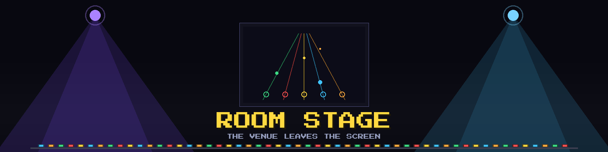

<div align="center">



# Room Stage — the venue leaves the screen

**Optional. Off by default. Your room becomes the concert.**

</div>

---

## The idea in one breath

BeatByte already draws a venue *behind* the highway: a light rig that
sweeps, an LED wall that pulses, a crowd on the beat. **Room Stage
turns that around — the venue is your actual room.** Smart bulbs
flash on your kicks. An LED strip runs a beam down the wall when you
hold a sustain. When you fire Hype, the whole room fires with you.

The trick that makes this *better* than any "music-reactive" light
you have seen: reactive lights **listen** to music through a
microphone and guess where the beat is. BeatByte does not have to
guess — **it knows.** It has the chart, the tempo map, the exact
millisecond of every note, and the judgment of every hit *you*
played. The room does not react to the song. It reacts to **you
playing the song.**

- Hit a note — a lamp answers, in your combo's color.
- Hold a sustain — the strip holds a burning beam with you.
- Miss — the room flinches.
- Activate Hype — double points, and the room goes white-hot.

No cloud, no account, no microphone. One switch in the settings,
plain HTTP on your own network, fire-and-forget: if no lights are
there, nothing happens and the game never stutters.

## The reference rig

Room Stage speaks to hardware through tiny HTTP services, so *any*
light you can put behind a local endpoint can join. The reference
setup this is designed against (a Raspberry Pi 5 on the LAN) already
runs two such services:

| Service | Port | Drives | Contract BeatByte can feed |
|---|---|---|---|
| **lichtwerk-controller** | `:5006` | 600-LED WS2812 strip | `POST /api/warn_kick {strength, bpm, vel, tone}` per kick · `POST /api/warn_event {kind, …}` for burst/sweep/shimmer/echo/meteor accents · `POST /api/warn_bass {level}` for the slow pressure wave · `POST /api/effect` to engage/release the scene |
| **disco-controller** | `:5007` | Philips Hue lamps (per-lamp round-robin, rate-limited) | today mic-driven; needs a small "external beat source" mode so BeatByte's ground-truth events replace the microphone (see TODO 5) |

The strip side needs **no changes at all**: lichtwerk's kick/event/
bass contract is already fire-and-forget, already tempo-locking,
already self-healing. BeatByte just becomes a *better* source than
the microphone that feeds it today — beats with zero detection
latency and a per-note strength the mic can never know (it comes
from *your* judgment, not from loudness).

## How it wires into the engine

BeatByte's architecture already produces exactly the right events —
this is a **listener**, not a gameplay change:

```text
SessionFeedback (already exists)          Room Stage bridge (new)
  NoteHit { judgment, lanes }      ──▶    warn_kick  strength = judgment weight
                                          tone      = lane (green low → orange high)
  sustain held (active_sustain)    ──▶    warn_bass  level = 1 while the beam burns
  HypeActivated                    ──▶    warn_event meteor / white accent
  NoteMissed / Overstrum           ──▶    a dip — the room flinches
  song start / end / pause         ──▶    engage / release the scene
  TempoMap (the chart)             ──▶    bpm rides along on every kick
```

The bridge is one background worker behind an `mpsc` channel — the
same pattern the music thread uses. Gameplay pushes an event and
moves on; the worker turns it into HTTP posts with a short timeout
and **drops** anything it cannot deliver. A dead Pi, a wrong URL, a
sleeping lamp: the game never blocks, never retries into a stutter,
never says a word mid-song.

Judgment stays untouched. Like the video offset and the note styles,
Room Stage is presentation only — the autopilot must score
identically with the bridge on and off, and a test will pin that.

## Why this feels the way it feels

A microphone-driven light show is always *late* and always *generic*:
it hears the mix, not the moment. Room Stage is **personal**. The
lights celebrate *your* perfect streak, not the song's loudness. Two
players on the couch produce two different rooms for the same track.
On a missed note the room drops out with you — and pulling the combo
back is something you feel on your skin, from the walls, not just
read in a corner of the screen.

## Wiring TODOs

Filed as the build order; nothing below is implemented yet.

1. **The bridge module** (`beatbyte-game`, feature-flagged): an
   `mpsc` worker thread mirroring `MusicHandle`'s pattern; consumes
   `SessionFeedback` + the tempo map; short-timeout HTTP posts,
   drop-not-block, silent no-op when unconfigured.
2. **The mapping, pure and pinned**: judgment → kick strength,
   lane → tone, Hype → event kind, miss → dip. Pure functions with
   unit tests, mutation-checked like every pin in this repo.
3. **Settings + UI**: a ROOM LIGHTS toggle (default OFF) and the
   endpoint base URL(s) in `settings.json`; a row on the settings
   screen; prompts follow the existing device-aware footer system.
4. **A verification screen**: extend INPUT TEST — press a fret, see
   the lamp lamp *in the room* answer. No guessing whether the wiring
   works mid-song.
5. **disco-controller: external beat source** (Pi side): a mode where
   POSTs from BeatByte replace the microphone analysis for the Hue
   path, with the mic reclaiming control when the game goes quiet —
   the same mutex discipline disco already uses between its own
   modes.
6. **Timing budget**: measure LAN + Zigbee latency end to end and
   decide whether kicks ride the audio clock or need a small
   configurable lead (the video-offset lesson: presentation may
   shift, judgment may not).
7. **The network promise**: the README currently states
   *network: never* — Room Stage must remain a documented, explicit
   opt-in exception (LAN only, outbound only, off by default), and
   the badge/legal section updated honestly the moment the feature
   ships.
8. **Autopilot coverage**: a harness switch that runs a song with the
   bridge pointed at a mock server, asserting identical scores and
   the expected post sequence.

## What this is not

- Not a cloud feature, not telemetry, not an account. Events leave
  the machine only if *you* point them at *your* lights.
- Not a gameplay modifier. The room follows the game; the game never
  follows the room.
- Not tied to one brand. Hue and WS2812 are the reference because
  they exist here; the contract is three tiny HTTP posts anything
  can implement.
